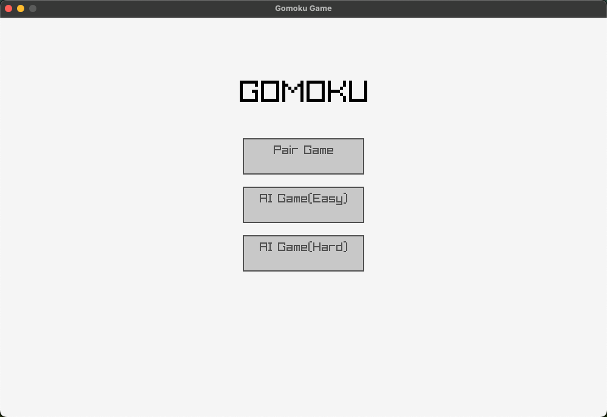
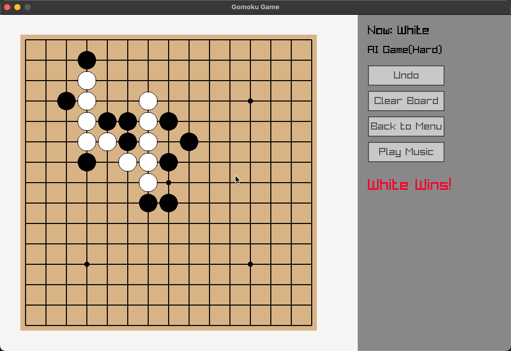

# 基于Raylib图形库的C++五子棋小游戏

## 1 开发环境
- macOS
- VsCode
- Raylib 图形库

## 2 环境配置
brew install raylib

## 3 运行步骤
1. 编译
clang++ ./src/main.cpp -o gomoku \
    -I/opt/homebrew/include \
    -L/opt/homebrew/lib \
    -lraylib \
    -framework OpenGL \
    -framework Cocoa \
    -std=c++17

2. 运行
./gomoku

## 4 功能介绍
详情见项目说明文档

## 5 效果预览

